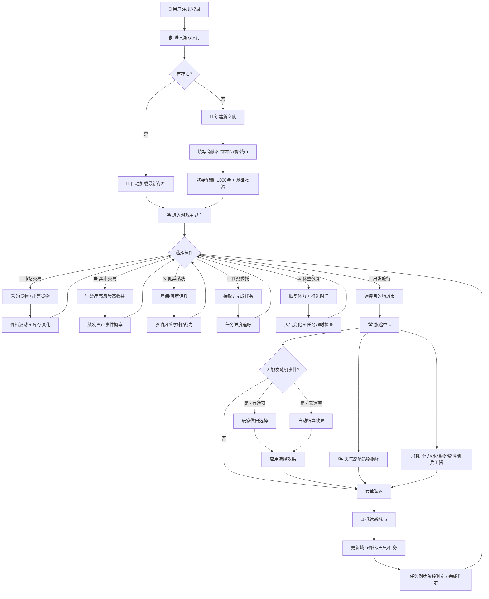
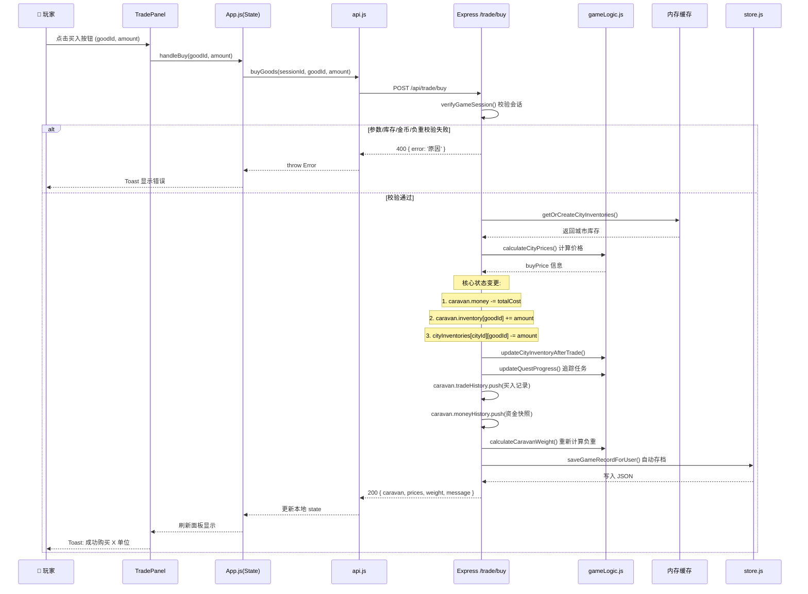
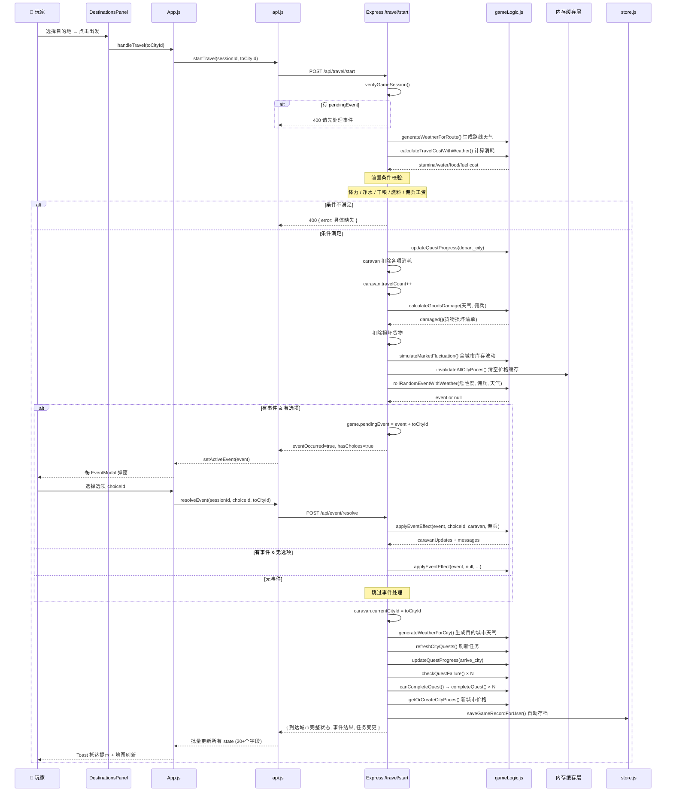

# 🏜️ 废土商队模拟器 - 游戏设计文档与数据流图

## 一、项目概览

### 1.1 基本信息
| 项目 | 详情 |
|------|------|
| **项目名称** | 废土商队模拟器 (Wasteland Caravan Simulator) |
| **项目类型** | 商队经营模拟 / 贸易策略游戏 |
| **技术架构** | 前后端分离 C/S 架构 |
| **前端技术** | React 18 + Recharts |
| **后端技术** | Node.js + Express + JWT 认证 |
| **数据存储** | JSON 文件系统（轻量级持久化） |
| **启动端口** | 5000 (前后端统一入口) |

### 1.2 目录结构
```
lyj-4/
├── client/                          # React 前端
│   ├── public/index.html            # HTML 入口
│   └── src/
│       ├── App.js                   # 主应用组件（状态中枢）
│       ├── api.js                   # API 客户端封装
│       ├── index.js                 # React DOM 挂载入口
│       ├── styles.css               # 全局样式
│       ├── context/AuthContext.js   # 用户认证上下文
│       └── components/              # UI 组件（15个）
│           ├── StartScreen.js       # 开始/创建商队界面
│           ├── AuthPage.js          # 登录注册页
│           ├── GameMap.js           # 废土地图组件
│           ├── TradePanel.js        # 常规市场交易
│           ├── BlackMarketPanel.js  # 黑市交易面板
│           ├── MercenaryPanel.js    # 佣兵雇佣面板
│           ├── DestinationsPanel.js # 目的地选择/旅行
│           ├── QuestsPanel.js       # 任务委托面板
│           ├── Inventory.js         # 背包/状态面板
│           ├── MoneyChart.js        # 资金曲线图表
│           ├── TradeLog.js          # 交易/事件日志
│           ├── EventModal.js        # 随机事件弹窗
│           ├── RecordsModal.js      # 存档记录弹窗
│           └── AdminPanel.js        # 管理员后台
└── server/                          # Express 后端
    ├── index.js                     # API 路由入口 & 会话管理中枢
    ├── middleware/auth.js           # JWT 认证中间件
    ├── routes/                      # 专项路由
    │   ├── auth.js                  # 注册/登录/账号管理
    │   ├── admin.js                 # 管理员 CRUD 操作
    │   └── records.js               # 游戏存档读写
    ├── data/                        # 数据层
    │   ├── initData.js              # 数据初始化总控
    │   ├── store.js                 # JSON 文件读写封装
    │   ├── cities.js                # 5座城市 + 7条商路数据
    │   ├── goods.js                 # 14种货物定义
    │   ├── events.js                # 10+随机事件模板
    │   ├── mercenaries.js           # 5名佣兵 + 城市分布
    │   ├── quests.js                # 6种任务模板 + 状态常量
    │   ├── weather.js               # 8种天气类型 + 区域偏好
    │   └── db/                      # 持久化 JSON 文件
    │       ├── users.json           # 用户账号表
    │       └── records/{userId}/    # 用户游戏存档
    └── game/
        └── gameLogic.js             # 核心游戏规则引擎（30+纯函数）
```

---

## 二、游戏主要游玩流程

### 2.1 完整玩家旅程图



### 2.2 核心玩法循环详解

#### 阶段 1：创建商队 (`/api/game/create`)
- 输入：商队名称、领袖姓名、起始城市（5选1）
- 初始配置：
  - 💰 金币：1000
  - ⚡ 体力：100/100
  - ⚖️ 最大负重：100
  - 🎒 初始物资：净水x5, 干粮x5, 药品x2, 武器x1, 废料x2
  - ⭐ 声望：50
  - 📍 位置：所选起始城市

#### 阶段 2：市场交易
- **常规市场** (`/api/trade/buy` / `/api/trade/sell`)
  - 9种常规货物（净水、干粮、药品、燃料、武器、钢材、废料、黑市药品、布料）
  - 买卖差价：买入价 = 基础价 × 1.1，卖出价 = 基础价 × 0.9
  - 受城市供需/库存影响，每笔交易后动态调价
- **黑市交易** (`/api/blackmarket/*`)
  - 仅灰烬堡垒、铁锈港、辐射城开放
  - 5种违禁品（稀有合金、核能核心、义体植入件、战前文物、强效兴奋剂）
  - 价格波动 ±40%，溢价 10%~30%
  - 交易有概率触发**黑市风险事件**（执法突袭/抢劫/告密）

#### 阶段 3：佣兵系统
- **可雇佣佣兵**（5名，按城市分布）：老兵杰克、猎手莎拉、机械师老周、狂战士铁锤、神枪手鹰眼
- **属性效果**：
  - `riskReduction`：降低事件触发概率（上限70%）
  - `lossReduction`：降低货物/金币损失（上限60%）
  - `combatPower`：战斗力（击退强盗等）
- **工资机制**：每次出发前支付所有佣兵日薪

#### 阶段 4：任务委托系统
- **任务类型**（6种模板）：货物运送、护卫任务、物资采购、走私任务、救援物资、情报传递
- **生命周期**：`AVAILABLE` → `ACCEPTED` → 多阶段流转 → `COMPLETED` / `FAILED`
- **最多同时接取**：3个任务
- **完成奖励**：金币 + 声望
- **失败惩罚**：违约金 + 声望下降
- **失败条件**：超时、货物丢失、偏离路线

#### 阶段 5：出发旅行 (`/api/travel/start`)
- **前置检查**：
  1. 体力充足（≥ 路线消耗）
  2. 净水/干粮/燃料充足
  3. 金币足以支付佣兵工资
  4. 无未处理的待决事件
- **行进消耗**：
  ```
  体力消耗 = 距离 × 0.08 × 天气体力系数
  燃料消耗 = 距离 × 0.025
  净水消耗 = 距离 × 0.015
  干粮消耗 = 距离 × 0.01
  ```
- **市场波动**：每次旅行后所有城市库存随机变化 ±10
- **天气货损**：恶劣天气按概率损坏 5%~20% 货物

#### 阶段 6：随机事件系统
- **触发概率**：`0.5 + 路线危险度 × 0.4`（受佣兵风险减免）
- **事件类型**：
  - 🔴 危险事件（强盗袭击、沙暴、车辆故障、辐射区...）
  - 🟢 好运事件（友好旅人、发现宝藏、废弃商队...）
  - 🟡 中立事件（路障检查、商人求助...）
- **处理方式**：
  - 有选项事件 → 存入 `pendingEvent`，前端弹窗让玩家选择
  - 无选项事件 → 直接结算应用效果
  - 选项效果类型：loseMoney / loseGoods / loseStamina / gainMoney / gainGoods / restoreStamina / useGoods / fightBack / delay

#### 阶段 7：休整恢复 (`/api/rest`)
- **消耗**：30金币 + 干粮x2 + 净水x2 + 佣兵工资
- **收益**：体力恢复 60 点
- **副作用**：天气变化 + 任务超时检查

---

## 三、数据流向图

### 3.1 系统整体数据流架构

```mermaid
flowchart LR
    subgraph 前端 Client
        UI[React 组件层\nApp.js 状态中枢]
        API_CLIENT[api.js\nfetch 封装]
        STORE_FE[localStorage\nJWT Token]
        AUTH_CTX[AuthContext\n用户状态]
    end

    subgraph 后端 Server
        EXPRESS[Express 服务器\nindex.js]
        MW[authMiddleware\nJWT 校验]
        SESSIONS[内存 Map\n游戏会话]
        CACHES[内存缓存层\n城市库存/价格/天气/任务]
        GAME_LOGIC[gameLogic.js\n30+ 纯函数]
        DATA_DEF[数据定义层\ncities/goods/events/mercs/quests/weather]
        ROUTES[专项路由\nauth/admin/records]
    end

    subgraph 持久化存储 Persistence
        JSON_FILES[JSON 文件系统]
        USERS[(users.json)]
        GOODS_DB[(goods.json)]
        CITIES_DB[(cities.json)]
        EVENTS_DB[(events.json)]
        MERCS_DB[(mercenaries.json)]
        RECORDS[(records/{userId}/*.json)]
    end

    UI -- "状态读写" --> AUTH_CTX
    AUTH_CTX -- "Token CRUD" --> STORE_FE
    UI -- "动作触发" --> API_CLIENT
    API_CLIENT -- "HTTP/JSON" --> EXPRESS
    EXPRESS -- "鉴权请求" --> MW
    MW -- "验证 Token" --> EXPRESS

    EXPRESS -- "会话读写" --> SESSIONS
    EXPRESS -- "缓存读写" --> CACHES
    EXPRESS -- "规则计算" --> GAME_LOGIC
    GAME_LOGIC -- "读取配置" --> DATA_DEF
    EXPRESS -- "专项接口" --> ROUTES

    DATA_DEF -- "初始化/管理员修改" --> JSON_FILES
    JSON_FILES -- "启动加载" --> DATA_DEF
    ROUTES -- "用户/存档" --> JSON_FILES
    EXPRESS -- "保存游戏" --> JSON_FILES

    JSON_FILES --> USERS
    JSON_FILES --> GOODS_DB
    JSON_FILES --> CITIES_DB
    JSON_FILES --> EVENTS_DB
    JSON_FILES --> MERCS_DB
    JSON_FILES --> RECORDS
```

### 3.2 核心交易数据流（买入货物）



### 3.3 跨城旅行完整数据流



### 3.4 游戏状态层级结构

```mermaid
graph TB
    subgraph GameState[🎮 单个游戏会话 Session]
        direction TB
        Caravan[🚚 商队 caravan]
        CityInventories[🏙️ 城市库存缓存<br/>cityInventoriesCache]
        CityPrices[💰 城市价格缓存<br/>cityPricesCache]
        BMPrices[🌑 黑市价格缓存<br/>blackMarketPricesCache]
        CityWeather[🌤️ 城市天气<br/>cityWeatherCache]
        Quests[📜 任务池<br/>questsCache]
        PendingEvent[⏳ 待处理事件 pendingEvent]
    end

    subgraph CaravanDetail[商队对象字段]
        direction TB
        CM[基础信息<br/>id/name/leader]
        Money[💰 money 金币]
        Stats[📊 状态<br/>stamina/maxStamina<br/>maxCarryWeight/travelCount<br/>reputation 声望]
        Location[📍 currentCityId]
        Inv[🎒 inventory<br/>{ goodId: amount }]
        Mercs[⚔️ mercenaries<br/>[ mercId, ... ]]
        History1[📋 tradeHistory[]<br/>交易/事件/旅行记录]
        History2[📈 moneyHistory[]<br/>资金变化曲线]
    end

    subgraph CityInventoriesDetail[城市库存结构]
        direction LR
        CI1["city-1 灰烬堡垒<br/>{ water: 45, food: 38, ... }"]
        CI2["city-2 绿洲镇<br/>{ water: 120, food: 115, ... }"]
        CI3["city-3..."]
        CI4["city-4..."]
        CI5["city-5..."]
    end

    subgraph QuestsDetail[单个任务对象]
        direction TB
        QM[id/title/description]
        QS[status: AVAILABLE/ACCEPTED/COMPLETED/FAILED]
        QC[fromCityId → toCityId]
        QR[requiredGoods 所需货物]
        QREW[reward 奖励: money + reputation]
        QPEN[penalty 惩罚: money + reputation]
        QSTG[stages[] 阶段流转<br/>currentStage]
        QPROG[progress{} 进度追踪]
        QTIME[expiresAt/deadline 时间限制]
    end

    GameState --> Caravan
    GameState --> CityInventories
    GameState --> CityPrices
    GameState --> BMPrices
    GameState --> CityWeather
    GameState --> Quests
    GameState --> PendingEvent

    Caravan --> CM
    Caravan --> Money
    Caravan --> Stats
    Caravan --> Location
    Caravan --> Inv
    Caravan --> Mercs
    Caravan --> History1
    Caravan --> History2

    CityInventories --> CI1
    CityInventories --> CI2
    CityInventories --> CI3
    CityInventories --> CI4
    CityInventories --> CI5

    Quests --> QM
    Quests --> QS
    Quests --> QC
    Quests --> QR
    Quests --> QREW
    Quests --> QPEN
    Quests --> QSTG
    Quests --> QPROG
    Quests --> QTIME
```

### 3.5 API 接口调用关系图

```mermaid
flowchart TD
    subgraph 用户认证
        A1[POST /api/auth/register] --> A[(users.json)]
        A2[POST /api/auth/login] --> A
        A3[GET /api/auth/profile] --> A
    end

    subgraph 游戏生命周期
        B1[POST /api/game/create] --> G1[初始化游戏会话]
        G1 --> S1[(gameSessions Map)]
        G1 --> S2[初始化各类缓存]
        G1 --> R1[(records/{userId}/.json)]
        
        B2[POST /api/game/load] --> L1[从 records 恢复]
        L1 --> S1
        L1 --> S2
        
        B3[POST /api/game/save] --> R1
        B4[POST /api/game/state] --> G2[获取完整状态]
    end

    subgraph 交易模块
        C1[POST /api/trade/buy]
        C2[POST /api/trade/sell]
        C3[POST /api/blackmarket/prices]
        C4[POST /api/blackmarket/buy]
        C5[POST /api/blackmarket/sell]
    end

    subgraph 佣兵模块
        D1[POST /api/mercenaries/available]
        D2[POST /api/mercenaries/hire]
        D3[POST /api/mercenaries/fire]
    end

    subgraph 任务模块
        E1[POST /api/quests/accept]
        E2[POST /api/quests/complete]
        E3[POST /api/quests/abandon]
        E4[POST /api/quests/refresh]
    end

    subgraph 旅行模块
        F1[POST /api/travel/start] --> F2{随机事件?}
        F2 -->|有选项| F3[pendingEvent 挂起]
        F3 --> F4[POST /api/event/resolve]
        F2 -->|无选项/无事件| F5[直接抵达]
        F4 --> F5
    end

    subgraph 状态维护
        G1 --> H1[休整]
        H1[POST /api/rest]
    end

    subgraph 通用数据
        I1[GET /api/cities]
        I2[GET /api/goods]
        I3[GET /api/events]
        I4[GET /api/mercenaries]
        I5[GET /api/weather]
        I6[GET /api/quests/config]
    end

    C1 & C2 & C3 & C4 & C5 --> P1[价格引擎]
    D1 & D2 & D3 --> P2[佣兵效果计算]
    E1 & E2 & E3 & E4 --> P3[任务状态机]
    F5 & F4 --> P4[事件效果引擎]
    H1 --> P5[天气/任务推进]
    
    P1 --> LogicCore[gameLogic.js<br/>规则计算核心]
    P2 --> LogicCore
    P3 --> LogicCore
    P4 --> LogicCore
    P5 --> LogicCore
```

---

## 四、核心数据结构定义

### 4.1 商队对象 (Caravan)
```javascript
{
  id: "uuid",              // 商队唯一ID
  name: "沙漠行者",        // 商队名称
  leader: "张三",          // 领袖姓名
  money: 1000,             // 金币余额
  maxCarryWeight: 100,     // 最大负重 kg
  stamina: 100,            // 当前体力
  maxStamina: 100,         // 最大体力
  currentCityId: "city-1", // 当前城市ID
  reputation: 50,          // 声望 0-100
  travelCount: 0,          // 旅行次数
  mercenaries: ["merc-1"], // 已雇佣佣兵ID列表
  inventory: {             // 货物库存 { goodId: 数量 }
    water: 5, food: 5, medicine: 2, weapons: 1, scrap: 2
  },
  tradeHistory: [ /* 交易/事件/旅行日志 */ ],
  moneyHistory: [ /* { time, money } 资金曲线 */ ]
}
```

### 4.2 城市对象 (City)
```javascript
{
  id: "city-1",
  name: "灰烬堡垒",
  description: "...",
  x: 150, y: 200,          // 地图坐标
  hasBlackMarket: true,    // 是否有黑市
  blackMarketRisk: 0.15,   // 黑市基础风险
  baseDemand: { water: 1.4, food: 1.1, ... },  // 基础需求系数
  baseSupply: { weapons: 1.5, steel: 1.4, ... } // 基础供给系数
}
```

### 4.3 价格计算公式
```javascript
// 核心函数: calculateCityPrices()
demandSupplyRatio = city.baseDemand[good] / city.baseSupply[good]
inventoryFactor = clamp(1 - (inventory / 100) * 0.5, 0.5, 1.5)
randomFactor = 随机(0.9 ~ 1.1)  // 黑市 ±20%

finalPrice = round(
  good.basePrice 
  × demandSupplyRatio 
  × inventoryFactor 
  × randomFactor
  × (blackMarket ? 1.1~1.3 : 1.0)
)

buyPrice = round(finalPrice × (黑市 ? 1.05 : 1.10))   // 玩家买入价
sellPrice = round(finalPrice × (黑市 ? 0.95 : 0.90))  // 玩家卖出价
```

### 4.4 旅行消耗 + 天气修正
```javascript
// 基础消耗
baseStamina = distance × 0.08
baseFuel = distance × 0.025
baseWater = distance × 0.015
baseFood = distance × 0.01

// 天气影响 (例: 沙暴)
weather.staminaCostMultiplier = 1.8
weather.travelSpeedMultiplier = 0.5
weather.goodsDamageChance = 0.25
weather.eventWeightModifiers = { danger: +5, good: -2, neutral: 0 }

actualStaminaCost = max(1, round(baseStamina × weather.staminaCostMultiplier))
effectiveDistance = round(distance / weather.travelSpeedMultiplier)
```

---

## 五、关键模块交互说明

| 模块 | 输入数据 | 处理逻辑 | 输出数据 | 关键函数 |
|------|----------|----------|----------|----------|
| **价格引擎** | 城市供需、库存、货物基础价、天气 | 需求供给比 × 库存因子 × 随机波动 | buyPrice, sellPrice, stock, 供需评级 | `calculateCityPrices()` |
| **旅行引擎** | 路线距离、天气、佣兵 | 消耗计算 + 货损 + 事件触发 | 消耗清单、货损清单、事件(可选) | `calculateTravelCostWithWeather()` `calculateGoodsDamage()` |
| **事件引擎** | 事件模板、选择、佣兵、库存 | 加权随机 → 概率应用各类效果 | caravanUpdates (金币/体力/物品/声望) | `rollRandomEventWithWeather()` `applyEventEffect()` |
| **任务状态机** | 任务模板、玩家动作、当前状态 | 阶段流转判定 + 完成/失败检查 | 任务状态更新 + 奖励/惩罚结算 | `updateQuestProgress()` `canCompleteQuest()` `completeQuest()` `failQuest()` |
| **天气系统** | 区域偏好、前序天气 | 加权马尔可夫链随机 | 城市天气 + 路线天气 | `generateWeatherForCity()` `generateWeatherForRoute()` |
| **黑市风险** | 城市风险、非法货值、佣兵 | 基础风险 × 交易乘数 × 佣兵减免 | 事件类型 + 损失清单 | `calculateBlackMarketRisk()` `rollBlackMarketEvent()` |
| **佣兵系统** | 佣兵属性数组 | 累加上限截断 | riskReduction(70%) lossReduction(60%) combatPower | `getMercenaryEffects()` |

---

## 六、核心代码文件索引

| 功能领域 | 核心文件 | 关键行号 |
|----------|----------|----------|
| 后端入口 & 所有API路由 | [server/index.js](file:///d:/git/lyj-4/server/index.js) | L120 会话校验; L305 创建游戏; L601/L698 买卖; L1150 旅行; L1516 事件解决; L1676 休整 |
| 游戏规则纯函数引擎 | [server/game/gameLogic.js](file:///d:/git/lyj-4/server/game/gameLogic.js) | L542 价格计算; L715 旅行消耗; L767/L149 事件; L806 事件效果; L206 任务生成; L279 任务进度 |
| 前端状态中枢 | [client/src/App.js](file:///d:/git/lyj-4/client/src/App.js) | L43 GameApp 主组件; L212 买入; L359 旅行; L435 事件决策; L483 休整 |
| API 客户端封装 | [client/src/api.js](file:///d:/git/lyj-4/client/src/api.js) | L47 所有 API 方法定义 |
| 用户认证上下文 | [client/src/context/AuthContext.js](file:///d:/git/lyj-4/client/src/context/AuthContext.js) | L6-L92 AuthProvider |
| 数据持久化层 | [server/data/store.js](file:///d:/git/lyj-4/server/data/store.js) | L110 保存存档; L124 读取用户存档列表 |
| 城市 & 路线数据 | [server/data/cities.js](file:///d:/git/lyj-4/server/data/cities.js) | L1 5座城市; L209 7条商路 |
| 货物定义 | [server/data/goods.js](file:///d:/git/lyj-4/server/data/goods.js) | L1 14种货物 (9常规+5黑市专属) |
| 佣兵定义 | [server/data/mercenaries.js](file:///d:/git/lyj-4/server/data/mercenaries.js) | L1 5名佣兵; L55 城市可用性映射 |
| 任务模板 | [server/data/quests.js](file:///d:/git/lyj-4/server/data/quests.js) | L1 6种任务模板 (运送/护卫/采购/走私/救援/情报) |
| 天气类型 | [server/data/weather.js](file:///d:/git/lyj-4/server/data/weather.js) | L1 8种天气 (晴→沙暴) + 区域偏好 |
| 事件模板 | [server/data/events.js](file:///d:/git/lyj-4/server/data/events.js) | L1 10+种随机事件及选项 |

---

> **文档生成日期**：2026-06-22  
> **基于代码版本**：当前工作区最新代码
